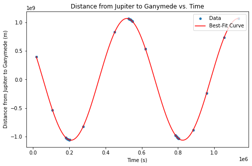
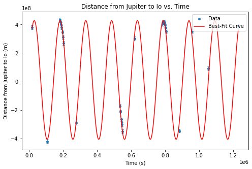
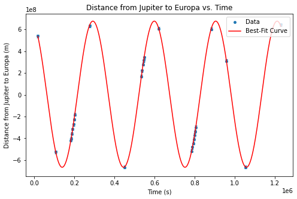
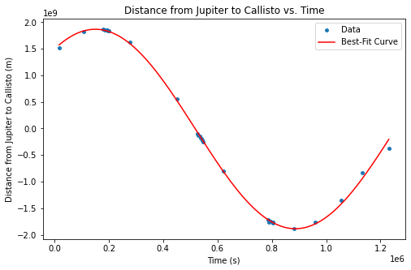
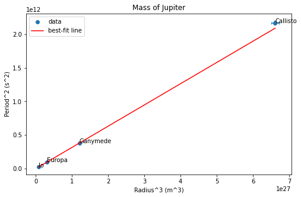

# Estimating the Mass of Jupiter 

## Introduction 
An object's mass can be determined by evaluating the gravitational force it exerts on nearby objects and observing how it influences their motion. This relationship can be used to estimate a planet's weight by observing the orbital period and semi-major axis of its moons. In this study, I observed Jupiter's four Galilean moons (Io, Europa, Ganymede, and Callisto) over a period of 18 Days and took snapshots using the Astronomy Student Taylor Robotic Observatory ([ASTRO](https://www.redlands.edu/study/schools-and-centers/college-of-arts-and-sciences/undergraduate-studies/physics/astronomy-student-taylor-robotic-observatory/)) at the University of Redlands. The distances from the center of the moons to the center of Jupiter were collected. From there, I was able to calculate the period and the radius of the moon's orbit. This relationship then allows me to estimate the mass using a linear regression. I measured the mass of Jupiter to be $(1.8711 \pm 0.0083) \times 10^{27}$ kg, which was an underestimate to the expected result of $(1.8981 \pm 0.0002) \times 10^{27}$ kg. This underestimate was due to the approximations made when measuring the distance between Jupiter and its moons as well as the assumptions made in the [Theory](#theory). 

## Theory
To determine the mass of Jupiter by observing the orbits of its four Galilean moons, Kepler's Third Law of planetary motion is used. For this experiment, it was approximated that the moons' orbits around Jupiter are circular (constant Radius) and the moons are only affected by Jupiter's gravity (no external forces). The net force on each of the moons is 

\begin{equation} 
F_{net}=ma=\frac{mv^2}{R} 
\tag{1.0}
\end{equation}

where $m$ is the mass of the moon and $a$ is the acceleration of the moon. From the assumption of the moon's circular orbit, the acceleration can be rewritten as the $\frac{v^2}{R}$, where $v$ is the velocity and $R$ is the orbital radius. From the assumption that the only gravitational force on the moons is Jupiter, the net force can also be written as  
\begin{equation} 
F_{net}=ma=\frac{GmM}{R^2} 
\tag{1.1}
\end{equation}
where $G$ is the gravitational constant and $M$ is the mass of Jupiter. By setting equation 1.0 and equation 1.1 equal to eachother an equation that is independent of the moon's mass is derived. 
\begin{equation} 
\frac{GM}{R^2} = v^2
\tag{1.2}
\end{equation}
Since the moons are in circular motion, the velocity can be written as 
\begin{equation} 
v=\frac{2 \pi R}{T}
\tag{1.3}
\end{equation}
where $T$ is the orbital period of the moon. Kelper's third law can now be derived by plugging the velocity equation (Eq. 1.3) into equation 1.2,
\begin{equation} 
T^2=\frac{4 \pi ^2 R^3}{GM}
\tag{2}
\end{equation}
which is now a relationship between the orbital period, $T$, and the radius of orbit, $R$, to the mass of Jupiter, $M$.
From the measured distances of the center of the moons to the center of Jupiter, the orbital periods, $T$, and radii, $R$ are estimated using a sinusoidal general fit function. With these values, a linear plot of $T^2$ versus $R^3$ is made, where the slope of that line will be
\begin{equation} 
s = \frac{4 \pi ^2}{GM}
\tag{3}
\end{equation}
which is from equation 2. To find the mass of Jupiter, solve for $M$ in equation 3,
\begin{equation} 
M = \frac{4 \pi ^2}{Gs}
\tag{4}
\end{equation}
The uncertainty for the mass of Jupiter was derived by taking the partial derivative of equation (4) with respect to s 
\begin{equation} 
U_{M}=\frac{4 \pi ^2 U_s}{Gs^2}
\tag{4.1}
\end{equation}
From the photos of Jupiter and the moon, a distance in pixels, $\Delta p_{J-m}$, is measured from the center of the moon to the center of Jupiter. The uncertainty of this distance, $U_{\Delta p_{J-m}}$, was estimated to be 10 pixels. A conversion is needed to change the distance from pixels to meters. The angular separation of Jupiter and each of its moons, $\Delta \theta _{J-m}$, is calculated by 
\begin{equation} 
\Delta \theta _{J-m}=\frac{ \Delta p_{J-m} a_{M}}{p_{M}}
\tag{5}
\end{equation}
where $\Delta p_{J-m}$ is the distance between Jupiter and one of its moons in pixels, $a_{M}$ is Earth's moon's angular diameter ([31 arcmin](https://lco.global/spacebook/sky/using-angles-describe-positions-and-apparent-sizes-objects/#:~:text=The%20angle%20covered%20by%20the,an%20angle%20of%2031%20arcmin.)), and $p_{M}$ is the diameter of Earth's Moon in pixels (Measured later in the experiment). From the angular separation and the distance from Earth to Jupiter, $R_{E-J}$, an equation for the distance (meters) between Jupiter and its moons is derived 
\begin{equation} 
X_{m-J} = R_{E-J}\Delta \theta _{J-m}
\tag{6}
\end{equation}
The uncertainty of the distance between Jupiter and one of its moons is 
\begin{equation} 
U_{X_{m-J}} = \sqrt{(\frac{R_{E-J}a_{M} U_{\Delta p_{J-m}}}{p_{M}})^2 + (\frac{R_{E-J} a_{M} \Delta p_{J-m} U_{p_{M}}}{p_{M} ^2})^2 }
\tag{6.1}
\end{equation}
where $U_{\Delta p_{J-m}}$ is the uncertainty of the distance in pixels from the center of a moon to the center of Jupiter and $U_{p_{M}}$ of the diameter of our Moon measured in pixels.

## Analysis
Over 30 snapshots were taking at different times at night in order to track the orbits of the moons of Jupiter, an example of these snapshots is below. 
<div style="text-align: center;">
    
</div>


After the collection of images of Jupiter and its moons, I used GIMP-2.10 to measure and estimate the distances from the center of Jupiter to the center of each of the moons in pixels. The time at which each photo was taken was noted in Pacific Standard Time, PST, and converted to Greenwich Mean Time, GMT. In order to convert the timestamp of each photo to seconds, a point of time needs to be selected as the start. The initial day of data collection, precisely at 0:00:00 GMT, was designated as the reference or 'time zero' in seconds. For the later photos, timestamps were then converted to their respective values in seconds, calculated from this established 'time zero'. The distance between Earth and Jupiter, $R_{E-J}$, was found using JPL’s Horizons system website. The accepted value for Earth’s moon angular diameter, $a_{M}$, is​​ $9.075712 \times 10^{-3}$ radians. The diameter of the Earth’s moon, $p_{M}$, was approximately $411010 \pm 10$ pixels and was estimated using GIMP-2.10. With these values for the Earth’s moon angular diameter and the diameter of Earth’s moon, the angular separation, $\Delta \theta _{J-m}$, was calculated using equation (5) for each data set of distances between Jupiter and one of Jupiter’s moons. Then with these values for angular separation and the values of the distances between Earth and Jupiter, the values for the separation between Jupiter and each of its moons, $X_{m-J}$ was calculated using equation (6). The uncertainty for the distances from the center of Jupiter to the center of each of the moons, $U_{\Delta \theta _{J-m}}$, was estimated to be 10 pixels. Then the uncertainty for the separation between Jupiter and each of its moons, $U_{X_{m-J}}$, was calculated using equation (6.1). 

In order to determine the period and the radius of orbit for each moon, the distance of separation between Jupiter was plotted against the time. Since it is in orbit, a sinusoidal shape is expected when plotting the distances. Therefore, the general fit function used to plot the data was a sinusoidal function,
\begin{equation} 
f(x)= asin(2T(t-t0))+b
\tag{7}
\end{equation}
where $a$ is the amplitude of the sinusoidal wave and represents the radius of the orbit, $T$ is the period of the sinusoidal function and represents the period of orbit, $t$ is the time of which the photo was taken in seconds, $t0$ is the time offset and $b$ is the y-intercept offset. The fit parameters from the fit function were the amplitude, $a$, the period, $T$, the time offset, $t0$, and the y-intercept, $b$.


```python
from __future__ import print_function
from fitting import *
import pylab as pl

MOON_ANG_DIA = 0.009075712
MOON_PIX_DIA = 4110

U_PIX_DIA = 10
U_DIS_MOON = 10

ganymede, io, europa, callisto, time_over, D_ej = np.genfromtxt('JupiterData.txt', unpack=True)

def CalcAngle(x):
    return np.multiply(x, MOON_ANG_DIA/MOON_PIX_DIA)

D_ej_m = np.multiply(D_ej, 1.496E+11)

def X_seperation(x):
    return np.multiply(x, D_ej_m)

def U_X_seperation(x):
    part1 = D_ej_m * U_DIS_MOON * MOON_ANG_DIA / MOON_PIX_DIA
    part2 = np.multiply(D_ej_m, x) * U_PIX_DIA * MOON_ANG_DIA / MOON_PIX_DIA**2
    return np.sqrt(np.add(np.power(part1, 2), np.power(part2, 2)))

g_ang = CalcAngle(ganymede)
i_ang = CalcAngle(io)
e_ang = CalcAngle(europa)
c_ang = CalcAngle(callisto)

g_sep = X_seperation(g_ang)
i_sep = X_seperation(i_ang)
e_sep = X_seperation(e_ang)
c_sep = X_seperation(c_ang)

U_g_sep = U_X_seperation(ganymede)
U_i_sep = U_X_seperation(io)
U_e_sep = U_X_seperation(europa)
U_c_sep = U_X_seperation(callisto)

def Moon(moon,moon_uncertainty,moon_name,time_over, amplitude, y_int, period, time_offset):
    moonData = []
    timeData = []
    U_moonData = []
    def fitfunc(x, a,b, T, t):
        return a*(sin(((2*pi/T)*(x-t))))+b

    for i in range(len(moon)):
        if moon[i] != 0:
            moonData.append(moon[i])
            timeData.append(time_over[i])
            U_moonData.append(moon_uncertainty[i])

    x = np.array(timeData)
    y = np.array(moonData)
    yerr = np.array(U_moonData)

    p0 = [amplitude,y_int,period, time_offset]
    popt, punc, rchi2, dof = general_fit(fitfunc, x, y, p0, yerr)
    print(moon_name,' optimal parameters: ', popt)
    print(moon_name,' uncertainties of parameters: ', punc)
    

    xf = pl.linspace(min(x),max(x),1000)
    yf = fitfunc(xf,*popt)

    pl.figure(figsize=(8,5))
    pl.scatter(x,y,s=15,label='Data')
    pl.errorbar(x, y, yerr, ls='None', capsize=2)
    pl.plot(xf,yf,"r-",label='Best-Fit Curve')
    pl.title(f'Distance from Jupiter to {moon_name} vs. Time')
    pl.xlabel('Time (s)')
    pl.ylabel(f'Distance from Jupiter to {moon_name} (m)')
    pl.legend(loc='upper right')

    return (popt[0], punc[0], popt[2], punc[2])

def Mass(radius, period, U_radius, U_period):
    y = np.power(period, 2)
    yerr = 2*period*U_period
    x = np.power(radius, 3)
    xerr = 3*(radius**2)*U_radius

    a, b, sa, sb, rchi2_2, dof2 = linear_fit(x,y, yerr, xerr)#,yerr,xerr)

    print('y = ax + b')
    print('a = ', a, ' +/- ', sa)
    print('b = ', b, ' +/- ', sb)
    
    JupiterMass = (4*pi**2)/(6.6743E-11 * a)
    U_JupiterMass = sa*(4*pi**2)/(6.6743E-11 *a**2)
    
    print(f"Jupiter Mass: {JupiterMass} +/- {U_JupiterMass}")
    
    xf = pl.linspace(min(x),max(x),100)
    yf = a*xf + b
    pl.figure(figsize=(8,5))
    pl.scatter(x,y,label='data')  # plot data
    pl.errorbar(x, y, yerr, xerr, ls='None', capsize=2)  # add error bars to data
    pl.plot(xf,yf,"r-",label='best-fit line')  # plot best-fit line
    pl.title('Mass of Jupiter')
    pl.ylabel('Period^2 (s^2)')
    pl.xlabel('Radius^3 (m^3)')
    pl.legend(loc='upper left')
    pl.annotate("Ganymede", (x[0], y[0]))
    pl.annotate("Io", (x[1], y[1]))
    pl.annotate("Europa", (x[2], y[2]))
    pl.annotate("Callisto", (x[3], y[3]))
```

# Moon Plots

## Ganymede


```python
g_R, g_U_R, g_T, g_U_T = Moon(g_sep, U_g_sep,"Ganymede", time_over, 6.06386328e+10, -5.76465208e+08, 6.08445496e+05, -2.44337228e+05)
pl.show()
```

    results of general_fit:
       degrees of freedom =  26
       reduced chi squared =  0.04055726550012907
    Ganymede  optimal parameters:  [ 1.06473492e+09  2.29987891e+06  6.17028250e+05 -2.53530459e+05]
    Ganymede  uncertainties of parameters:  [5.80776999e+05 5.62683999e+05 1.79113021e+02 2.60195518e+02]


    

    


From the plot of the distance between Ganymede and Jupiter against time, seen above, the orbital radius was estimated to be $(1.0647 \pm 0.0006) \times 10^9$ m and the period of the orbit was estimated to be $(6.170 \pm 0.020) \times 10^5$ s. These values are consistent with the expected values for Ganymede’s orbital radius of $1.07 \times 10^9$ m and Ganymede’s period of orbit of $6.192 \times 10^5$ s. 

## Io


```python
i_R, i_U_R, i_T, i_U_T = Moon(i_sep, U_i_sep,"Io", time_over, -2.40497796e+10,  20,  1.49596674e+05, -6.82836150e+04)
pl.show()
```

    results of general_fit:
       degrees of freedom =  23
       reduced chi squared =  3.933714692294664
    Io  optimal parameters:  [-4.16343550e+08  1.10454876e+07  1.51762179e+05 -8.37467024e+04]
    Io  uncertainties of parameters:  [6.95870136e+06 6.18836146e+06 2.66264040e+02 1.37738129e+03]


    

    


From the plot of the distance between Io and Jupiter against time, seen above, the orbital radius was estimated to be $(4.1634 \pm 0.0695)\times 10^8$ m and the period of the orbit was estimated to be $(1.518 \pm 0.003) \times 10^5$ s. The orbital radius was consistent with the expected values for Io’s orbital radius of $4.22 \times 10^8$ m and the orbital period was a slight overestimate of the expected Io’s period of $1.512 \times 10^5$ s.

## Europa


```python
e_R, e_U_R, e_T, e_U_T = Moon(e_sep, U_e_sep,"Europa", time_over, 3.5e+10, 50, 306000, 2.19739610e+05)
pl.show()
```

    results of general_fit:
       degrees of freedom =  24
       reduced chi squared =  0.23570067563429084
    Europa  optimal parameters:  [6.70725469e+08 4.90984782e+06 3.06593108e+05 2.15507939e+05]
    Europa  uncertainties of parameters:  [2.03005053e+06 1.65674296e+06 1.27941348e+02 2.04110013e+02]


    

    


From the plot of the distance between Europa and Jupiter against time, seen above, the orbital radius was estimated to be $(6.7073 \pm 0.0203) \times 10^8$ m and the period of the orbit was estimated to be $(3.066 \pm 0.001) \times 10^5$ s. These values are consistent with the expected values for Europa’s orbital radius of $6.71 \times 10^8$ m and Europa’s period of orbit of $3.06 \times 10^5$ s.

## Callisto


```python
c_R, c_U_R, c_T, c_U_T = Moon(c_sep, U_c_sep,"Callisto", time_over, 1.07E11 ,100, 1.469e+6, 0)
pl.show()
```

    results of general_fit:
       degrees of freedom =  27
       reduced chi squared =  10.311894112953372
    Callisto  optimal parameters:  [ 1.87684171e+09 -8.80350916e+06  1.47287993e+06 -2.17816116e+05]
    Callisto  uncertainties of parameters:  [1.06206628e+07 1.04794624e+07 9.52353457e+03 6.25743840e+03]


    

    


From the plot of the distance between Callisto and Jupiter against time, seen above, the orbital radius was estimated to be $(1.8768 \pm 0.0011) \times 10^9$ m and the period of the orbit was estimated to be $(1.473 \pm 0.010) \times 10^6$ s. The orbital radius was an underestimate of  the expected values for Callisto’s orbital radius of $1.8839 \times 10^9$ m and the period was consistent with Callisto’s period of orbit of $1.469 \times 10^6$ s.

# Jupiter Mass Calculation


```python
period = np.array([g_T, i_T, e_T, c_T])
U_period = np.array([g_U_T, i_U_T, e_U_T, c_U_T])

radius = np.array([g_R, abs(i_R), e_R, c_R])
U_radius = np.array([g_U_R, i_U_R, e_U_R, c_U_R])

Mass(radius, period, U_radius, U_period)
pl.show()
```

    results of linear_fit:
       reduced chi squared =  2.196518069531133
       degrees of freedom =  2
    y = ax + b
    a =  3.1613109812374987e-16  +/-  1.4089919925660071e-18
    b =  -824900263.3002827  +/-  1255913840.432729
    Jupiter Mass: 1.8710560309426984e+27 +/- 8.33927121022625e+24


    

    


The mass of Jupiter was calculated using equation (4), with the slope value, $s$, derived from the line of best fit in the above plot. The gravitational constant, $G$, was $6.6743 \times 10^{-11} \frac{m^3}{kg s^2}$. The uncertainty in Jupiter's mass was computed using equation (4.1), where $U_{s}$ represents the uncertainty in the slope of the line of best fit.

The estimated mass of Jupiter was $(1.8711 \pm 0.0083) \times 10^{27}$ kg, slightly below the expected value of $(1.8981 \pm 0.0002) \times 10^{27}$ kg. This discrepancy can be attributed to several approximations made during the experiment. Firstly, the assumption of perfectly circular orbits is invalid, as the orbits are elliptical. Secondly, considering only Jupiter's influence on the moons disregards external forces that do impact their motion. Lastly, the pixel-based distance measurements may not have provided the required precision for a more accurate calculation. Despite these limitations, the estimated mass is consistent with the expected value. 
